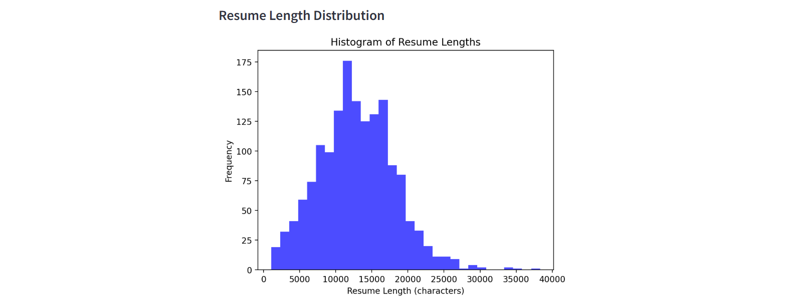
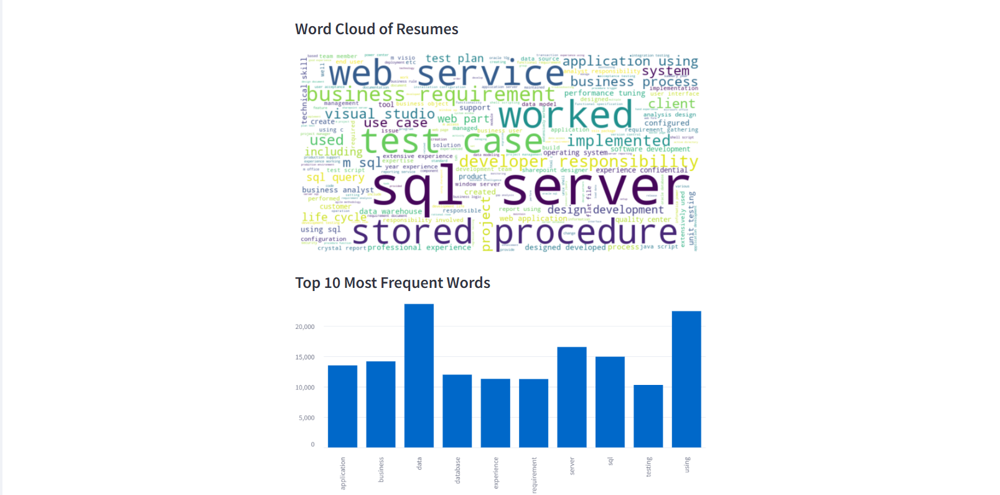
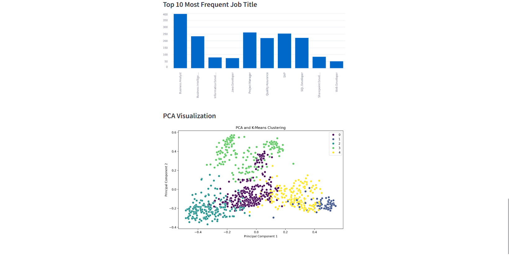

# ML-Internship-Home-Assignment

## Requirements
- Python 3.9 or higher.

#### Create new environment
-  py -3.11 -m venv projectenv (use version of Python less than 3.12 to avoid the problem of installing the packages , for example "numpy=1.24.3".)
#### Install Poetry on your global Python setup
-  pip install poetry.


#### Install Poetry on the project 
 - poetry install

#### Activate the virtual environment
-In my example i run the commandes from "Git Bash" :
  - Navigate into the folder path : cd "/c/Users/yanou/OneDrive/Bureau/ML-Internship-Home-Assignment-main/ML-Internship-Home-Assignment-main"
  - activate the virtual environment : source projectenv/Scripts/activate
  - 
#### Install wordcloud  package
- pip install wordcloud
  
#### Install sqlalchemy  package
- pip install sqlalchemy

#### Install nltk  package
- pip install nltk
#### - Start the application
```sh
    sh run.sh
```
- API : http://localhost:8000
- Streamlit Dashboard : http://localhost:9000


# Assignment 
## Assignment Process

•	Refactor the dashboard component to replace the existing single long Python file, which is unoptimized, hard to read, maintain, and upgrade, with a suitable solution that optimizes the code and improves readability:
-	Create a folder named Component that contains all the necessary components for use in the dashboard.py file:
-	Include a base_component.py file, which serves as an abstraction or blueprint for components in the application.
- Add a component_manager.py file, which acts as a feature for easily adding or removing components in the dashboard.
- Include an eda_component.py file for the Exploratory Data Analysis component.
- Add an inference_component.py file for the Inference component.
- Include a training_component.py file for the Training component.
 o	Create a folder named helperfunction to store functions used in the Exploratory Data Analysis component, such as dataset_advanced_analysis.py, dataset_distribution.py, and dataset_overview.py. These functions are stored here to avoid having one long Python file.
•	Create a folder named utils inside the ML-Internship-Home-Assignment directory. This folder will contain a file named helpers.py:
  -	The helpers.py file includes functions such as display_metrics(), load_sample_text(), run_inference(), save_inference(), and others. These functions will be used in both the inference and training components.
•	Update the train_pipeline.py file:
  -	Replace the NaiveBayesModel with a new model that combines the logistic regression model with TfidfVectorizer and the GridSearchCV algorithm to improve prediction results.
  -	Fix the render_confusion_matrix() function to display the confusion matrix for the predicted results.
  -	Remove the if __name__ == "__main__" phase, as it is unnecessary in this case.
•	Create a new file named logistic_model.py to be used in inference_route.py for making predictions based on the logistic model.
•	Create a new file named database.py, which serves as the backbone of the application's interaction with the database system:
 -	Establish a connection to the database and ensure necessary tables are created if they do not already exist.
 -	Provide functionality for saving values to the database and retrieving them efficiently.
 -	Ensure seamless data handling and enhance application reliability by managing database operations centrally.
•	Update the inference_route.py file:
 -	Replace the NaiveBayesModel with the logistic model.
 -	Update the PIPELINE_PATH.
 -	Add new endpoints to save results to the database and retrieve information from it.
•	Update the utils/constant.py file:
 -	Add the path for the logistic model pipeline.


## Application Interface 

### 1 - Exploratory Data Analysis


##

##

##

##

##

##

##

##


### 2 - Training 


##

##

### 3 - Inference


##

##

##

## Prospective Feature
•	For the inference_component, the ID of each reference is already displayed. Additional features will be added to allow users to delete unwanted inferences based on their ID.

Feel free to reach out for questions or feedback:
- **Email:**  [anouzlay@gmail.com](mailto:anouzlay@gmail.com)
- **GitHub:** [Anouzlay](https://github.com/Anouzlay)


